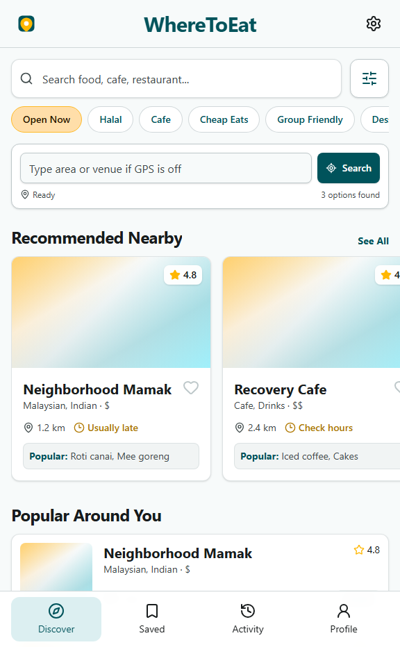
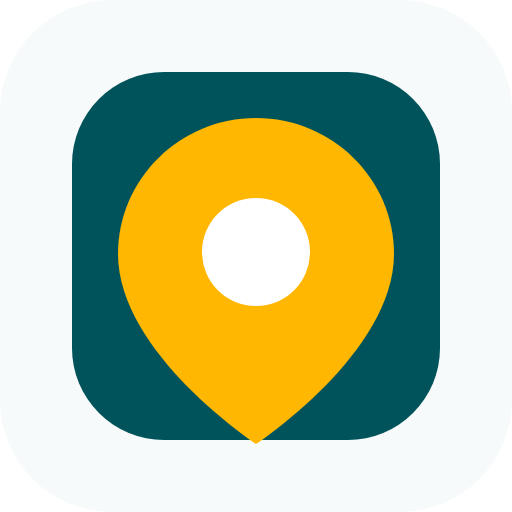

# WhereToEat

WhereToEat is a mobile-first web app for quickly finding nearby food, cafes, and chill spots. It opens straight into the search experience, lets users search by GPS or typed location, shows selectable restaurant cards, and sends users to Google Maps for live directions, reviews, and opening hours.



## What It Does

- Search nearby food using phone location or a manual area.
- Browse recommended places, popular places, and saved-style quick picks.
- Filter by distance, price, cuisine, halal, and group-friendly options.
- Open a restaurant detail sheet with highlights, amenities, address, hours, and Maps actions.
- Copy or share restaurant links.
- Install as a basic PWA from a phone browser.

## Design

The UI is based on the Google Stitch design direction and uses one simple brand system:

- Primary teal: `#00535b`
- Accent yellow: `#ffb702`
- Background: `#f7fafa`
- Surface: `#ffffff`
- Text: `#181c1d`

The logo is a simplified nearby-location mark:



## Tech Stack

- React
- TypeScript
- Vite
- Tailwind CSS
- shadcn/ui-style components
- Radix UI primitives
- lucide-react icons
- Vitest and Testing Library

## How To Run

Install dependencies:

```bash
npm install
```

Start the local app:

```bash
npm run dev
```

Open the local URL shown by Vite, usually:

```text
http://127.0.0.1:5175/
```

## Useful Commands

```bash
npm test
npm run lint
npm run build
```

## Project Notes

- No backend, accounts, or database are used in this MVP.
- GPS history is not stored.
- Restaurant live data is intentionally lightweight; Google Maps handles the full live shop data, reviews, directions, and hours.
- Local preferences such as filters and radius can be saved in `localStorage`.

